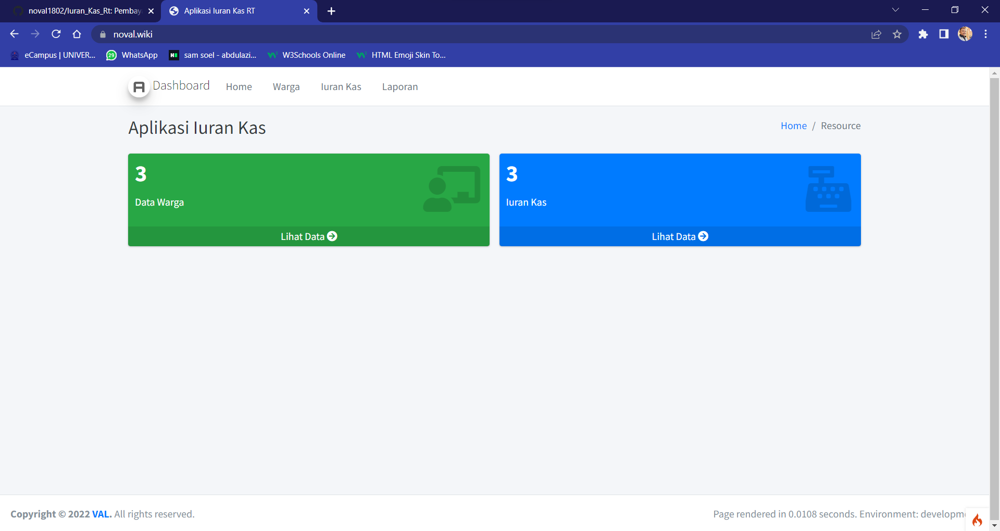
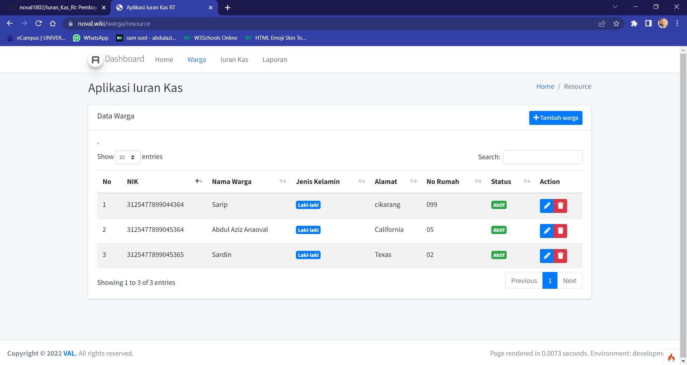
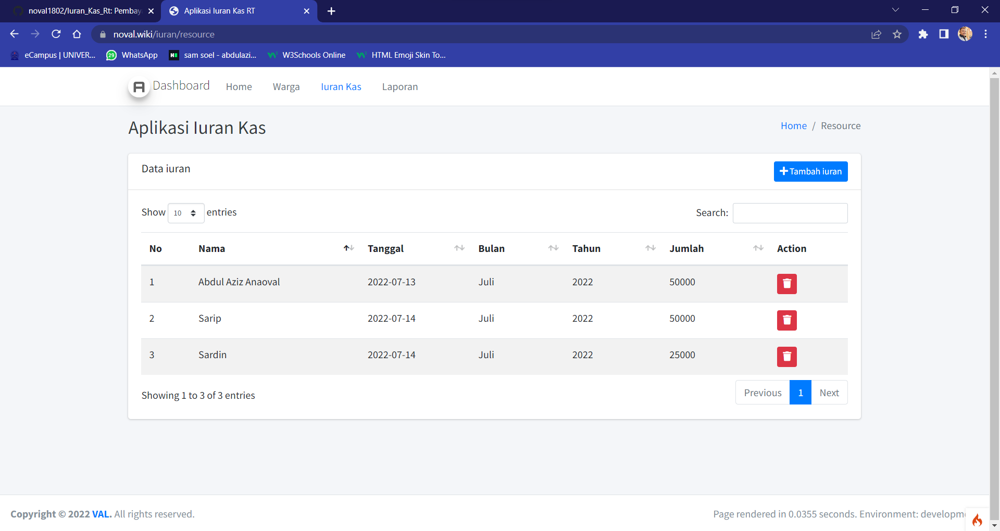
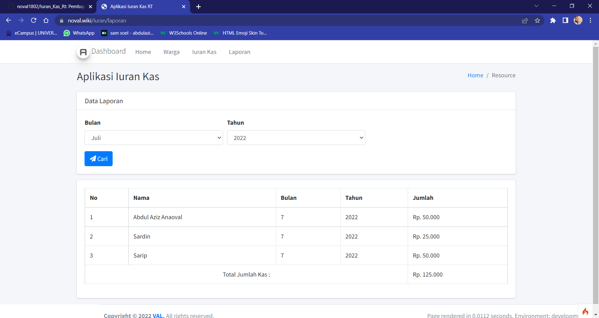

# APLIKASI IURAN KAS RT 
ubah lah file .env-exemple menjadi .env dan vendor-exemple menjadi vendor

### Clone repository;

```
git clone https://github.com/noval1802/Iuran_Kas_Rt.git
```
### Pindah ke directory iuran_kas;

```
cd Iuran_Kas_Rt
```

### composer install

* [composer_install](https://getcomposer.org/Composer-Setup.exe)

Setelah SetUp composer

```
composer install
```

### Buat database baru. Kemudian rename file .env.example ke .env selanjutnya sesuaikan dengan konfigurasi database:

```
database.default.hostname = localhost
database.default.database = iuran_kas_rt
database.default.username = root
database.default.password =
database.default.DBDriver = MySQLi
```

### Migrasi database:

```
php spark migrate
```
### Jalankan aplikasi dengan perintah:

```
php spark serve
```
Sekarang buka browser dengan alamat address http://localhost:8080/

# Screenshoot | Demo on [Iuran-kas](https://noval.wiki/)

* Home


* Warga


* Iuran


* Laporan kas
